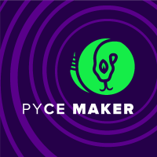

# Aprendizagem por Projetos Integrados 2021-1

No sexto semestre do Curso de Análise e Desenvolvimento de sistemas na FATEC - São José dos Campos, foi identificado pela empresa parceira a necessidade de realizar o desenvolvimento de um software com alternativas disruptivas que alertam sobre os riscos de indisponibilidade de seus produtos, tendo em vista que a disponibilidade de suas aplicações é uma preocupação constante em seu dia-a-dia.

### Parceiro Acadêmico
UOL: O UOL é uma empresa brasileira de conteúdo, produtos e serviços de Internet do Grupo UOL PagSeguro. De acordo com o Comscore, o portal ocupa a terceira posição de sites mais visitados da Internet no Brasil, atrás do Google e do Facebook. Ainda de acordo com o Comscore, o UOL é o maior portal do Brasil com mais de 114 milhões de visitantes únicos por mês e 7,4 bilhões de páginas visitadas mensalmente [uol.com.br](https://www.uol.com.br/).

***

### Visão do Projeto

O Pycemaker visa ser uma ferramenta de monitoramento e previsão relacionado aos riscos de indisponibilidade, falhas ou mesmo lentidão dentro de uma aplicação qualquer que contemple alguns requisitos para que seja possível a aquisição dos dados estatísticos sobre o consumo da aplicação no ambiente.

Pycemaker foi desenvolvido para receber informações providas da ferramenta Prometheus, que fornece diversos dados analíticos de uma aplicação alvo desde o consumo do ambiente no servidor até o tráfego na rede.

A ferramenta foi aplicada monitorando uma aplicação simples de cadastro, desenvolvida também pelo time Pycemaker. 

A aplicação fornece os seguintes recursos para o monitoramento e previsão de indisponibilidade do sistema:
- **Envio de e-mail de alerta estatístico:** Informar dados analíticos *near real time* sobre o estado de um recurso consumido quando a aplicação alvo atingir níveis preocupantes de consumo do ambiente para a sua disponibilidade.
- **Envio de e-mail analítico:** Periodicamente um e-mail analítico será disparado para os responsáveis pela aplicação, contendo uma série temporal com os dados estatísticos do consumo da aplicação alvo no ambiente e também dados trabalhados por uma Inteligencia Artificial que visa prever o consumo no ambiente a partir do histórico de consumo da aplicação monitorada.  
- **Dashboard atualizado em tempo real:** As informações do Dashboard são provenientes da mesma origem das informações do e-mail analítico, sendo assim a ideia do Dashboard é a mesma: Fornecer uma série temporal com os dados estatísticos de consumo do ambiente e também fornecer dados trabalhados com o intuito de prever o consumo no ambiente a partir doe seu histórico. 

    **As diferenças entre o e-mail analítico e o Dashboard são:** 
    - O Dashboard fornecerá as informações de uma maneira mais visual que o e-mail; e
    - O Dashboard é atualizado em *near real time*, fornecendo informações novas a todo momento, enquanto o e-mail analítico fornece um recorte na série temporal que será atualizado apenas no próximo e-mail.

#### Lista de Requistos 

`Requisitos Funcionais` requeridos pelo cliente foram:
1. Desenvolver um formulário de cadastro, com os campos: Nome, E-mail, Senha e Celularo; 
2. Fornecer uma forma de consulta dos cadastros realizados; e
3. Prever falhas de software, picos de consumo no ambiente e outras situações que podem causar a indisponibilidade da Aplicação;

`Requisitos não Funcionais`:
1. O tempo de resposta do backend de cadastros deve ser abaixo de 300ms;
2. O tempo de resposta do backend de consulta de cadastros deve ser abaixo de 100ms;
3. Desenvolver backend da aplicação formulário utilizando a linguagem `java` em conjunto do Framework `Springboot`; e
4. Desenvolver o frontend da aplicação formulário utilizando a linguagem `JavaScript` em conjunto do Framework `vue`.
***

#### link do repositório no Github
[Repositório](https://github.com/pycemaker)

# CONTINUAR DAQUI

### Tecnologias adotadas na solução
Para obter o resultado esperado, a equipe utilizou as seguintes tecnologias:

     
    
    
    
    

    
    
    
    

- [HTML](https://devdocs.io/html/), [CSS](https://devdocs.io/css/) e [JavaScript](https://www.javascript.com/): Criação e desenvolvimento do design da Interface do usuário.
- [React Native](https://reactnative.dev/): Para a criação de aplicativos Nativos.
- [Expo Go](https://expo.dev/): Plataforma de código aberto para fazer aplicativos nativos universais para Android, iOS e web com JavaScript e React.
- [Node](https://nodejs.org/en/): Construção do serviço API's contendo as rotas e funcionalidades da aplicação.
- [Mongo](https://www.mongodb.com/): Banco de dados não relacional, baseado em documentos.
- [Firebase](https://firebase.google.com/): Utilizado para hospedagem de arquivos de imagem.
- [docker](https://www.docker.com/): Utilizado para facilitar a instalação do sistema entre os desenvolvedores

### Funcionamento

Abaixo alguns vídeos para demonstração da utilização da ferramenta OnlyMotors em seu resultado final.

## Chat e Pesquisa
1. Registro de Anúncios no sistema. (o sistema de cadastro de usuários segue o mesmo padrão).

2. Cadastro de usuário. Painel de controle onde podemos ver o usuário alterando dados pessoais e seus anúncios. 

https://user-images.githubusercontent.com/56441534/143039123-8b3985e6-1df7-43ca-a382-a9ff30762b41.mp4

4. Pesquisa de veículos anunciados, com filtros de:
    - Marca;
    - Modelo;
    - Ano; e
    - Valor.

5. Chat em tempo real, onde um usuário comum entra em contato com o anúnciante através de outro dispositivo.

6. Documentação Viva do serviço de API utilizando `Swagger`:

### Contribuições Pessoais
Para desenvolver este projetos, utilizamos a stack MERN (React.js + Node.js + Express + MongoDB). Durante o desenvolvimento, atuei no BackEnd, subindo o servidor e criando as rotas. Também atuei criando a documentação viva do servidor de API, utilizando a ferramenta Swagger. 

Para a ultima entrega deste projeto, trabalhei na criação de um Dockerfile e um Docker-compose, onde o Docker-Compose contém dois serviços integrados aplicados ao API.

### Hard Skills
Dentre as habilidades técnicas, obtive o seguinte avanço:
- Criação de serviços de API utililizando `Node JS`:
    - Sei fazer com ajuda.
- Criação de UI (User Interface) utilizando `HTML`, `CSS`, `JavaScript` e `React JS`:
    - Sei Fazer com Ajuda.
- `Docker`:
    - Sei utilizar com ajuda.
- Criação de Documentação viva de APIs utilizando `Swagger`:
    - Sei fazer com autonomia.
- Utilização do banco de dados não relacional `Mongo DB`:
    - Sei fazer com autonomia.

### Soft Skills
Foi utilizado a metodologia SCRUM para o gerenciamento do tempo, cards e planejamentos.
Durante este projeto atuei como desenvolvedor backend em minha equipe, consegui participar ativamente das reuniões e entrega dos requisitos solicitados pelo cliente.
 
