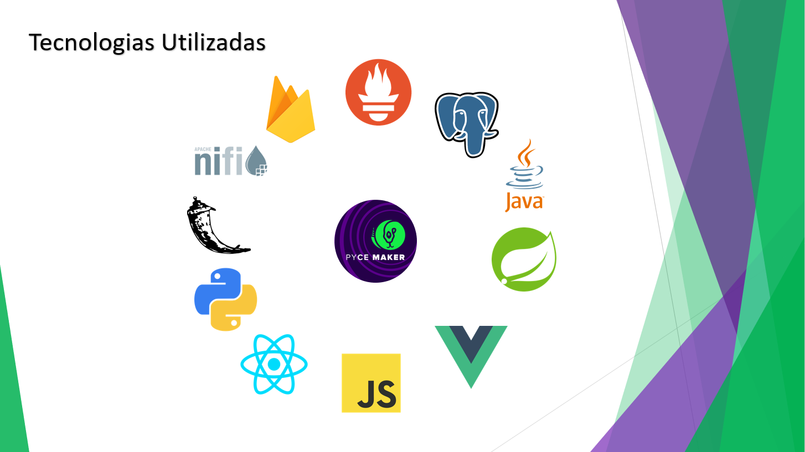
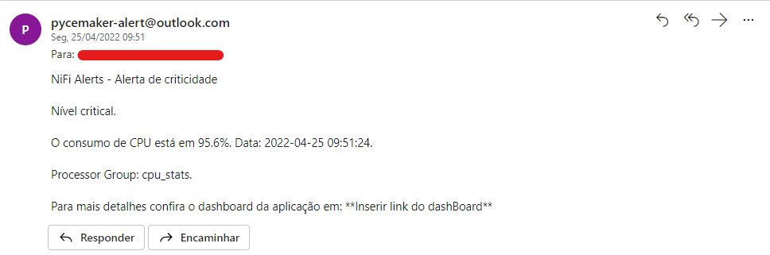
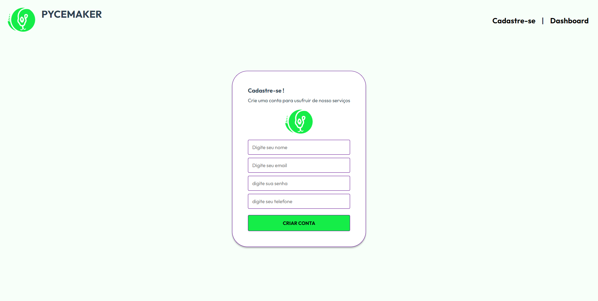

# Aprendizagem por Projetos Integrados 2021-1

No sexto semestre do Curso de Análise e Desenvolvimento de sistemas na FATEC - São José dos Campos, foi identificado pela empresa parceira a necessidade de realizar o desenvolvimento de um software com alternativas disruptivas que alertam sobre os riscos de indisponibilidade de seus produtos, tendo em vista que a disponibilidade de suas aplicações é uma preocupação constante em seu dia-a-dia.

## Parceiro Acadêmico
UOL: O UOL é uma empresa brasileira de conteúdo, produtos e serviços de Internet do Grupo UOL PagSeguro. De acordo com o Comscore, o portal ocupa a terceira posição de sites mais visitados da Internet no Brasil, atrás do Google e do Facebook. Ainda de acordo com o Comscore, o UOL é o maior portal do Brasil com mais de 114 milhões de visitantes únicos por mês e 7,4 bilhões de páginas visitadas mensalmente [uol.com.br](https://www.uol.com.br/).

***

## Visão do Projeto

O Pycemaker visa ser uma ferramenta de monitoramento e previsão relacionado aos riscos de indisponibilidade, falhas ou mesmo lentidão dentro de uma aplicação qualquer que contemple alguns requisitos para que seja possível a aquisição dos dados estatísticos sobre o consumo da aplicação no ambiente.

Pycemaker foi desenvolvido para receber informações providas da ferramenta Prometheus, que fornece diversos dados analíticos de uma aplicação alvo desde o consumo do ambiente no servidor até o tráfego na rede.

A ferramenta foi aplicada monitorando uma aplicação simples de cadastro, desenvolvida também pelo time Pycemaker. 

A aplicação fornece os seguintes recursos para o monitoramento e previsão de indisponibilidade do sistema:
- **Envio de e-mail de alerta estatístico:** Informar dados analíticos *near real time* sobre o estado de um recurso consumido quando a aplicação alvo atingir níveis preocupantes de consumo do ambiente para a sua disponibilidade.
- **Envio de e-mail analítico:** Periodicamente um e-mail analítico será disparado para os responsáveis pela aplicação, contendo uma série temporal com os dados estatísticos do consumo da aplicação alvo no ambiente e também dados trabalhados por uma Inteligencia Artificial que visa prever o consumo no ambiente a partir do histórico de consumo da aplicação monitorada.  
- **Dashboard atualizado em tempo real:** As informações do Dashboard são provenientes da mesma origem das informações do e-mail analítico, sendo assim a ideia do Dashboard é a mesma: Fornecer uma série temporal com os dados estatísticos de consumo do ambiente e também fornecer dados trabalhados com o intuito de prever o consumo no ambiente a partir doe seu histórico. 

    **As diferenças entre o e-mail analítico e o Dashboard são:** 
    - O Dashboard fornecerá as informações de uma maneira mais visual que o e-mail; e
    - O Dashboard é atualizado em *near real time*, fornecendo informações novas a todo momento, enquanto o e-mail analítico fornece um recorte na série temporal que será atualizado apenas no próximo e-mail.

### Lista de Requistos 

`Requisitos Funcionais` requeridos pelo cliente foram:
1. Desenvolver um formulário de cadastro, com os campos: Nome, E-mail, Senha e Celularo; 
2. Fornecer uma forma de consulta dos cadastros realizados; e
3. Prever falhas de software, picos de consumo no ambiente e outras situações que podem causar a indisponibilidade da Aplicação;

`Requisitos não Funcionais`:
1. O tempo de resposta do backend de cadastros deve ser abaixo de 300ms;
2. O tempo de resposta do backend de consulta de cadastros deve ser abaixo de 100ms;
3. Desenvolver backend da aplicação formulário utilizando a linguagem `java` em conjunto do Framework `Springboot`; e
4. Desenvolver o frontend da aplicação formulário utilizando a linguagem `JavaScript` em conjunto do Framework `vue`.
***

### link do repositório no Github
[Repositório](https://github.com/pycemaker)

### Tecnologias adotadas na solução
Para obter o resultado esperado, a equipe utilizou as seguintes tecnologias:

     
     
     
     
     
     
     
    
    
     
    
     

- [JavaScript](https://www.javascript.com): Linguagem de programação interpretada estruturada;
- [vue](https://br.vuejs.org/): Framework progressivo para a construção de interfaces de usuário;
- [React Native](https://reactnative.dev/): Para a criação de aplicativos Nativos;
- [Java](https://www.oracle.com/java/): Linguagem de programação orientada a objetos;
- [Spring](https://spring.io/): Framework java para criação de aplicações web.
- [Python](https://www.python.org/): Linguagem de programação de alto nível;
- [Flask](https://flask.palletsprojects.com/): Micro framework python para criação de aplicações web;
- [nifi](https://nifi.apache.org/): Software para automatizar o fluxo de dados entre sistemas de software;
- [prometheus](https://prometheus.io/): Ferramenta Open Source de monitoramento;
- [Mongo](https://www.mongodb.com/): Banco de dados não relacional, baseado em documentos;
- [postgres](https://www.postgresql.org/): Banco de dados Relacional;
- [Firebase](https://firebase.google.com/): Utilizado para hospedagem de arquivos de imagem.

## Funcionamento

Abaixo algumas imagens para demonstração da utilização da ferramenta Pycemaker em seu resultado atual.

### **Envio de e-mail de alerta estatístico**:
- 

### **Envio de e-mail analítico**:
- 

### **Dashboard atualizado em tempo real**:
- 

### **Aplicação alvo monitorada (formulário pycemaker)**:
#### **Cadastro**:
 - 

#### **Dashboard**:
- 

### Contribuições Pessoais

#### Hard Skills
Dentre as habilidades técnicas, obtive o seguinte avanço:
- Criação de fluxos de dados, utilizando a ferramenta de ETL `nifi`:
    - Sei fazer com autonomia.

- Desenvolvimento do seridor de API com `python` em conjunto do micro framework `flask`:
    - Sei fazer com autonomia.

- Criação de modelo de Machine Learning utilizando python em conjunto de bibliotecas específicas para o desenvolvimento:
    - Sei fazer com ajuda.

- Utilização do banco de dados não relacional `Mongo DB`:
    - Sei fazer com autonomia.

### Soft Skills
Foi utilizado a metodologia SCRUM para o gerenciamento do tempo, cards e planejamentos.
Durante este projeto atuei na parte de Engenharia de dados, sendo responsável pelo trafégo dos dados na aplicação, e também no desenvolvimento do modelo de Machine Learning a fim de criar a inteligencia artificial responsável pelas previsões de indisponibilidade do sistema. 
Participei ativamente das reuniões e entrega dos requisitos solicitados pelo cliente.